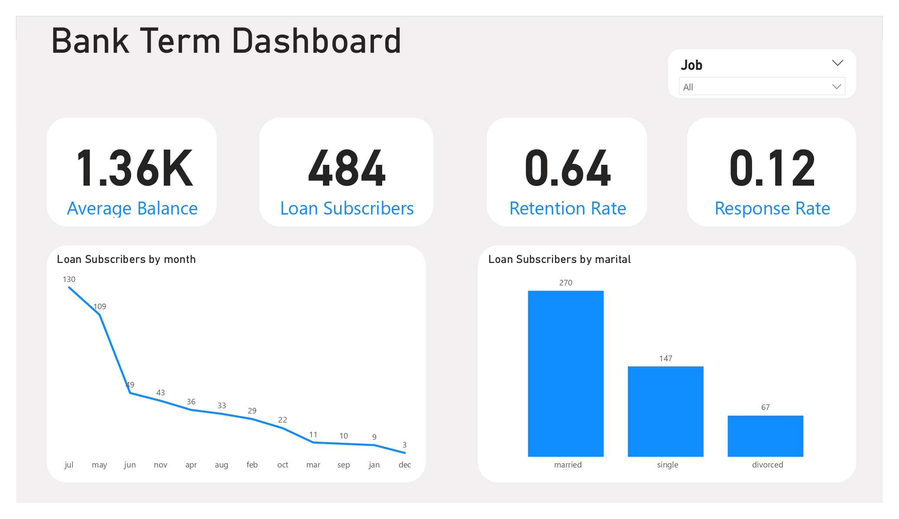

# Power BI Bank Term Deposit Subscription Dashboard Project

## Project Overview

**Introduction:** This document offers a comprehensive technical overview of the Power BI Bank Term Deposit Subscription Dashboard Project.

**Purpose and Objectives:** The primary aim of this project is to create an interactive and insightful dashboard for the analysis of marketing campaign data.

## Data Sources

**Data Sources Description:** Our primary data sources encompass customer data, campaign data, and survey data.

**Data Collection:** Data is gathered through various methods, including API integrations, manual inputs, and automated data feeds.

**Data Transformation:** Power Query is utilized for data transformations, encompassing data cleaning, filtering, and merging.

## Data Modeling

**Calculated Columns and Measures:** To generate a calculated column named 'Response,' we employed the following DAX formula: `Response = IF([y] = "yes", 1, 0)`. This column assigns a value of 1 or 0 to each row based on the content of the 'y' column.

## Dashboard Design

**Design Philosophy:** The dashboard prioritizes user-friendliness and interactivity.

**Layout and Visuals:** It features a clean layout with various visuals, including visual cards, line charts, and bar charts.

**User Interface Elements:** Interactive elements such as slicers, filters, and drill-through options are thoughtfully positioned to facilitate easy data exploration.

## Key Performance Indicators (KPIs)

**KPI Explanation:** The dashboard monitors several KPIs, including Average Account Balance, Loan Subscribers, Response Rate, and Retention Rate.

**Formulas and Calculations:** Each KPI is computed using DAX formulas, providing real-time insights into campaign performance.

## Data Visualization

**Visual Descriptions:** Visualizations consist of visual cards representing key performance indicators (KPIs) such as Response Rate, Retention Rate, Loan Subscribers, and Average Account Balance. Additionally, a line chart illustrates the trend of loan subscribers over the course of the month, while a bar chart offers insights into the distribution of loan subscribers by marital status.

**Purpose and Insights:** These visuals aid users in comprehending campaign effectiveness, customer behavior, and financial performance.

## Slicers and Filters

**Slicer Explanation:** Slicers and filters empower users to interactively explore data by selecting specific demographics, time periods, and campaign types. However, our visualizations primarily focus on utilizing the 'Job' demographic for filtering and analysis.

**Usage Guidelines:** Users can easily filter data by clicking on slicers or use the drill-through feature to gain more detailed insights.

## Measures and Calculations

**List of DAX Measures:** Measures include:

- **Average Account Balance:** `Average Balance = AVERAGE('bank-dataset'[balance])`
- **Loan Subscribers:** `Loan Subscribers = COUNTROWS(FILTER('bank-dataset', [loan] = "yes" && [y] = "yes"))`
- **Response Rate:** `Response Rate = DIVIDE(SUM('bank-dataset'[Response]), COUNTROWS('bank-dataset'))`
- **Retention Rate:** `Retention Rate = DIVIDE(COUNTROWS(FILTER('bank-dataset', [y] = "yes")), COUNTROWS(FILTER('bank-dataset', [previous] > 0)))`

**Purpose and Usage:** These measures empower users to analyze and compare KPIs across different dimensions effectively.

